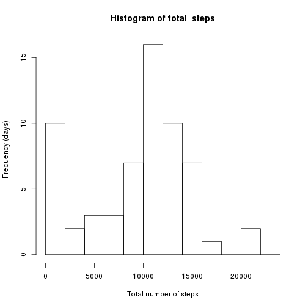
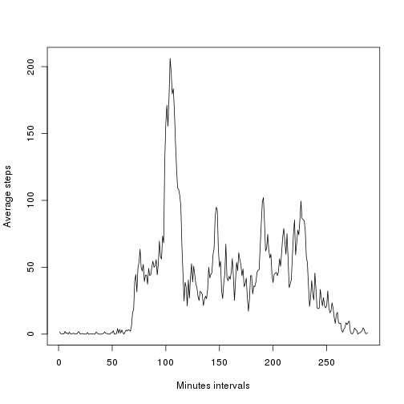
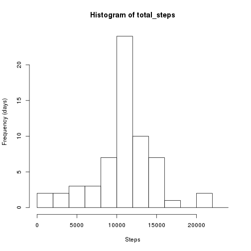
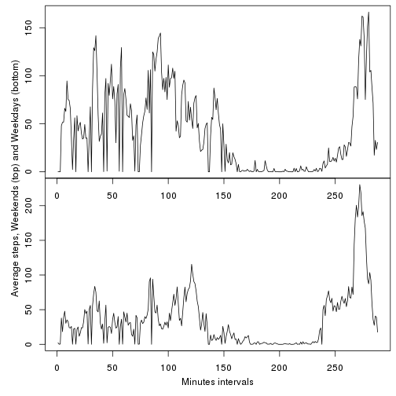

## Loading and preprocessing the data
Unzip the compressed file and read the csv

```r
files <- unzip('activity.zip')
data <- read.csv(files[1], colClasses = c('integer','factor','factor'))
```

## What is mean total number of steps taken per day?
Using the tapply function we can quickly computer the total number of steps
per day and present it in a nice table

```r
total_steps <- tapply(data$steps, data$date, sum, na.rm=TRUE)
```

But the table above is better visualised in the form of an histogram

```r
hist(total_steps, breaks = seq(0,25000,2000), xlab='Total number of steps',
                                              ylab='Frequency (days)')
```

 

One of the things to note is that there are about 10 days for which we do not
have data.

The mean and median of the above distribution is given by:

```r
mean(total_steps)
```

```
## [1] 9354.23
```

```r
median(total_steps)
```

```
## [1] 10395
```

## What is the average daily activity pattern?
If we want to see how activity level change over the course of a day we can
use tapply to calculate a mean of steps for each sample period (every 5 minutes).

NOTE: the second line of code in this snippet is necessary to ensure the plot
is properly ordered as the output of tapply does not necessarly return the time
intervals in order.

```r
intervals <- tapply(data$steps, data$interval, mean, na.rm=TRUE)
intervals <- intervals[as.character(sort(as.numeric(names(intervals))))]
plot(intervals, xlab='Minutes intervals', ylab='Average steps', type='l')
```

 

The time interval where the average number of steps is higher is given by:

```r
sort(intervals, decreasing = TRUE)[1]
```

```
##      835 
## 206.1698
```

## Imputing missing values
There are a fair bit of missing data. Let's see how many samples are affected

```r
sum(!complete.cases(data))
```

```
## [1] 2304
```

For those samples missing data we will use the average steps (across all days)
for that particular time interval. We first determine the indexes of the samples
missing data and find the corresponding average from the average per time 
interval vector calculated above.


```r
filled_data <- data
naidx <- filled_data[is.na(filled_data$steps),]$interval
filled_data[is.na(filled_data$steps),]$steps <- intervals[as.character(naidx)]
```

We can now perform a similar analysis to the one we did above over the original
dataset regarding the total number of steps per day but this time we will use
the new dataset with the missing values filled with interval daily averages.

```r
total_steps <- tapply(filled_data$steps, filled_data$date, sum, na.rm=TRUE)
```

The left most bar of the histogram as significantly decreased since the missing
values were represented as 0 in the histogram above.

```r
hist(total_steps, breaks = seq(0,25000,2000), xlab='Steps',
                                              ylab='Frequency (days)')
```

 

The mean and median also changed

```r
mean(total_steps)
```

```
## [1] 10766.19
```

```r
median(total_steps)
```

```
## [1] 10766.19
```

The mean and median of the distribution now match. This is a direct effect of
using interval step averages to fill the missing data for about 10 days.

## Are there differences in activity patterns between weekdays and weekends?
Let's create a factor variable to disintiguish samples taken on a weekday and 
on a weekend, so we can look at how the levels of activity change between those 
days.

```r
filled_data$daytype <- ifelse(weekdays(as.Date(filled_data$date)) %in% c("Saturday","Sunday"),
                        "weekend",
                        "weekday")
filled_data$daytype <- as.factor(filled_data$daytype)
```

Once again the tapply function does the job here, calculating the means for each
sample interval on weekdays and weekends separately.

```r
intervals2 <- tapply(filled_data$steps, list(filled_data$daytype, filled_data$interval)
                                      , mean
                                      , na.rm=TRUE)
```

We now finally plot the data to visually compare the levels of activity. It seems
that weekend activity is higher in general.

```r
par(mfrow = c(2,1))
par(mar = c(0,0,0,0), oma = c(4,4,0.5,0.5))
plot(intervals2['weekend',], type='l')
plot(intervals2['weekday',], type='l')
mtext("Minutes intervals", outer = TRUE, side = 1, line = 2.2)
mtext("Average steps, Weekends (top) and Weekdays (bottom)", outer = TRUE, 
                                                             side  = 2, 
                                                             line  = 2.2)
```

 
